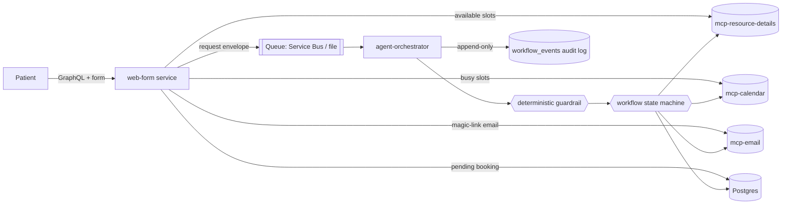

# Appointment Scheduling Agent

A calendaring system for booking bookable **resources** (e.g. a doctor →
"doctor appointment"). Patients verify their email, pick a resource and an
available time within opening hours, and an **agentic orchestrator** validates
and executes the booking — creating Google Calendar events and sending email
notifications through **remote MCP tools**.

Postgres is the system of record; Google Calendar is a synced projection. The
whole stack runs **offline** in Docker with `FAKE_PROVIDERS=true` (in-memory
calendar/email), so you can test validation and orchestration without any Google
or Azure account.

---

## Architecture



### Components

| Component | Path | Role |
|-----------|------|------|
| web-form | `services/web-form` | Strawberry GraphQL edge + GraphiQL playground, magic-link auth, availability preview, form UI |
| agent-orchestrator | `services/agent-orchestrator` | Queue consumer, **guardrail**, **state machine**, **audit**, workflow, LLM adapter |
| mcp-resource-details | `mcp-servers/mcp-resource-details` | Resource details + opening hours (MCP tool) |
| mcp-calendar | `mcp-servers/mcp-calendar` | Google Calendar CRUD + busy lookup (MCP tool, Google + fake) |
| mcp-email | `mcp-servers/mcp-email` | Send email (MCP tool, Gmail + fake) |
| shared | `services/shared` | Contracts, config, DB models/session, MCP client, queue |
| db | `db` | Alembic migrations + seed |
| infrastructure | `infrastructure` | Terraform for the AKS stack |
| deploy/helm | `deploy/helm` | Kubernetes/Helm manifests |

### Design decisions

- **GraphQL only at the edge**; all agent-to-tool traffic is **MCP**.
- **Postgres is authoritative.** A partial unique index on
  `(resource_id, start_utc)` for active bookings prevents double-booking and
  closes the check-then-book race window.
- **Validation is a deterministic guardrail**, not an LLM — reproducible and
  unit-testable. The **workflow state machine** decides *which* steps are legal
  and in *what order*; the LLM only composes message text.
- **Full auditability:** every guardrail decision, transition, and tool call is
  appended to `workflow_events`. Reconstruct any booking's lifecycle via the
  GraphQL `bookingTimeline` query or `audit.reconstruct_timeline`.
- **Timezone-aware** throughout: times stored in UTC, opening hours evaluated in
  the resource's IANA timezone.

### Request contracts (JSON)

Appointment / cancellation carry a single `slot`; **reschedule carries both**
`old_slot` and `new_slot`. The agent returns an `AgentResult`
(`type`, `resource`, `booking_id`, `status`, `slot`, `reason`).

---

## Setup

### Prerequisites

- **Docker + Docker Compose** — for the full containerised stack.
- **Python 3.12** and [`uv`](https://docs.astral.sh/uv/) — for local
  (non-container) runs, tests, and the inject CLI.
- **Node.js / `npx`** *(optional)* — only for the bundled MCP Inspector targets.
- **`make`** *(optional)* — convenience targets. On Windows use Git Bash / WSL,
  or run the underlying commands directly.

### Configure environment

```bash
cp .env.example .env      # defaults work out of the box (FAKE_PROVIDERS=true)
```

The defaults run the whole stack **offline** with in-memory calendar/email
providers and a file-backed queue — no Google or Azure account required. See
[Switching to real Google + Azure](#switching-to-real-google--azure) to go live.

---

## Running

### Option A — Everything in Docker (recommended)

```bash
docker compose up --build          # foreground; Ctrl-C to stop
# or, detached:
make up                            # docker compose up --build -d
```

This starts Postgres, runs migrations + seed (Dr Lee, Dr Patel; hours
09:00–17:00 Mon–Fri), then launches the three MCP servers, the web-form service,
and the agent-orchestrator.

| Endpoint | URL |
|----------|-----|
| Booking form | <http://localhost:8080> |
| GraphQL Playground (GraphiQL) | <http://localhost:8080/graphql> |
| mcp-resource-details | <http://localhost:8081/mcp> |
| mcp-calendar | <http://localhost:8082/mcp> |
| mcp-email | <http://localhost:8083/mcp> |
| Postgres | `localhost:5432` (`appt` / `appt`) |

Useful commands:

```bash
docker compose logs -f agent-orchestrator   # follow one service's logs
docker compose ps                           # container status
docker compose down                         # stop the stack
make down                                   # stop AND wipe volumes (fresh DB)
```

### Option B — Local Python environment (no containers)

Create the virtualenv and install the workspace packages in editable mode:

```bash
uv venv .venv --python 3.12
uv pip install --python .venv pytest pytest-asyncio ruff \
  -e services/shared -e services/agent-orchestrator -e services/web-form
# or simply:
make venv && make install
```

Use this environment for the unit/scenario tests and the inject-a-message CLI
below. To run the web-form or MCP servers locally you still need a Postgres
instance (e.g. `docker compose up postgres migrate`) and a populated `.env`.

---

## Testing the agent (validation + orchestration)

The system is designed so orchestration is easy to verify. From fastest to
fullest:

### 1. Unit + scenario tests (no services needed)

```bash
cd services/agent-orchestrator
../../.venv/Scripts/python.exe -m pytest -q
```

Covers:
- **Guardrail** (`tests/test_guardrail.py`): unverified patient, out-of-hours,
  double-booked, unknown resource → exact rejection reasons.
- **State machine** (`tests/test_state_machine.py`): legal vs illegal transitions.
- **Orchestration + audit** (`tests/test_orchestration.py`): appointment,
  cancel→reschedule-offer, reschedule (incl. taken slot / out-of-hours),
  idempotent duplicate, DB double-book guard, and **timeline reconstruction**.
- **Scenario/eval suite** (`tests/scenarios/*.json`): declarative
  input → expected ordered tool-call trace + final status. Add a case by dropping
  in a JSON file — no code required.

### 2. Inject-a-message CLI (fastest end-to-end loop)

Publish a request straight onto the queue and run the agent once, printing the
**tool-call trace** and **audit timeline**:

```bash
cd services/agent-orchestrator
../../.venv/Scripts/python.exe -m scripts.inject appointment \
  --resource "Dr Lee" --email you@example.com \
  --start 2026-07-13T09:00:00+10:00 --run
```

Use `cancellation` / `reschedule` similarly (see `make inject-*`).

### 3. MCP Inspector (bundled)

Manually invoke each MCP server's tools/schemas (servers must be running):

```bash
make inspect-resources   # npx @modelcontextprotocol/inspector http://localhost:8081/mcp
make inspect-calendar
make inspect-email
```

### 4. GraphQL Playground

Open <http://localhost:8080/graphql> and exercise `resources`,
`availableSlots`, `startVerification`, `requestAppointment`, and
`bookingTimeline`.

---

## Deploy (AKS)

1. **Provision infrastructure** (ACR, AKS with workload identity, Postgres,
   Service Bus, Key Vault, AI Foundry):

   ```bash
   cd infrastructure
   terraform init
   terraform apply -var-file=environments/dev.tfvars
   ```

2. **CI/CD** — GitHub Actions:
   - `.github/workflows/ci.yml`: lint, tests, Terraform validate, image builds.
   - `.github/workflows/deploy.yml`: Azure OIDC login → build/push images to ACR
     → `helm upgrade` to AKS (runs the DB migration Job). Set `fakeProviders=false`
     and provide real Google/Azure secrets via Key Vault for production.

3. **Secrets** (production) are sourced from Key Vault into the
   `appointment-secrets` Kubernetes secret (`DATABASE_URL`,
   `SERVICE_BUS_CONNECTION_STRING`, `MCP_API_KEY`, `AZURE_AI_PROJECT_ENDPOINT`,
   Google credentials).

---

## Switching to real Google + Azure

Set `FAKE_PROVIDERS=false` and provide:
- Google OAuth token/credentials (`GOOGLE_CREDENTIALS_FILE`, `GOOGLE_TOKEN_FILE`)
  with Calendar + Gmail scopes; `GMAIL_SENDER`.
- `AZURE_AI_PROJECT_ENDPOINT` + `AZURE_AI_AGENT_MODEL` for the Foundry agent that
  composes patient-facing message text.
- `SERVICE_BUS_CONNECTION_STRING` to use Azure Service Bus instead of the local
  file queue.

Providers are pluggable (`CalendarProvider`, `EmailProvider`) — Outlook/Exchange
can be added without touching the agent workflow.

---

## Repository layout

```
services/{shared,web-form,agent-orchestrator}
mcp-servers/{mcp-resource-details,mcp-calendar,mcp-email}
db/                 # Alembic migrations + seed
infrastructure/     # Terraform (AKS stack)
deploy/helm/        # Kubernetes manifests
.github/workflows/  # CI + Deploy
docker-compose.yml  # local stack
```
